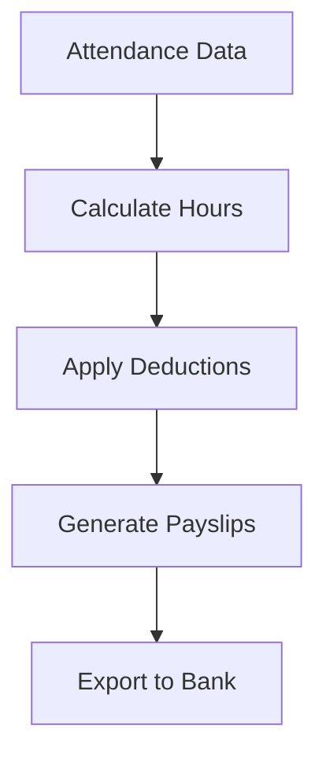

## Overview

Mosambee provides comprehensive HR tools to streamline your workforce management. You track attendance, automate payroll, empower employees with self-service options, and gain insights through analytics. Each feature integrates seamlessly, reducing manual work and improving accuracy.

<Columns cols={2}>
  <Card title="Attendance & Time Tracking" icon="clock" href="#attendance">
    Monitor employee hours with real-time clock-ins and geofencing.
  </Card>
  <Card title="Payroll Processing" icon="dollar-sign" href="#payroll">
    Automate salary calculations and compliance checks.
  </Card>
  <Card title="Employee Self-Service" icon="user" href="#self-service">
    Let employees manage their own data and requests.
  </Card>
  <Card title="Analytics & Reporting" icon="bar-chart-3" href="#analytics">
    Visualize performance trends and export custom reports.
  </Card>
</Columns>

## Attendance and Time Tracking

Capture accurate time data to eliminate buddy punching and overtime disputes. You configure rules for shifts, breaks, and locations using Mosambee's biometric or mobile app options.

<Steps>
  <Step title="Set Up Tracking" icon="settings">
    Define shift schedules in the dashboard.

````javascript
// API to create a shift
fetch('https://api.example.com/v1/shifts', {
  method: 'POST',
  headers: { 'Authorization': 'Bearer YOUR_API_KEY' },
  body: JSON.stringify({
    employeeId: 'emp_123',
    startTime: '09:00',
    endTime: '17:00',
    location: 'office_hq'
  })
});
````
  </Step>
  <Step title="Employee Clock-In" icon="clock">
    Employees scan or tap to log time.
  </Step>
  <Step title="Review Reports" icon="file-text">
    Export daily summaries for verification.
  </Step>
</Steps>

<Callout kind="tip">
  Enable geofencing for remote teams to ensure clock-ins occur within approved radii.
</Callout>

## Payroll Processing Workflows

Automate payroll from attendance data to payments. Mosambee handles deductions, taxes, and multi-currency support.



<Tabs>
  <Tab title="Monthly Payroll" icon="calendar">
    Run batch processing for salaried employees.
  </Tab>
  <Tab title="Hourly Wages" icon="clock">
    Integrate overtime multipliers automatically.
  </Tab>
</Tabs>

## Employee Self-Service Portals

Employees access their profiles, request leaves, and view payslips without HR intervention. You customize portals with role-based permissions.

<CodeGroup tabs="JavaScript,Python">
  ```javascript
  // Fetch employee profile
  const profile = await fetch('https://api.example.com/v1/employees/me', {
    headers: { 'Authorization': 'Bearer YOUR_TOKEN' }
  }).then(res => res.json());
  console.log(profile.payslips);
  ```
  ```python
  # Fetch employee profile
  import requests
  response = requests.get(
      'https://api.example.com/v1/employees/me',
      headers={'Authorization': 'Bearer YOUR_TOKEN'}
  )
  print(response.json()['payslips'])
  ```
</CodeGroup>

## Analytics and Reporting Tools

Unlock insights with dashboards showing attendance trends, absenteeism rates, and productivity scores. Schedule automated reports via email.

| Metric | Description | Use Case |
|--------|-------------|----------|
| Attendance Rate | Percentage of scheduled hours worked | Identify chronic absentees |
| Overtime Hours | Total extra time logged | Budget planning |
| Leave Balance | Remaining PTO days | Approval decisions |

<Expandable title="Advanced Custom Reports" default-open="false">
  Build queries for department-specific analytics.

````sql
SELECT department, AVG(attendance_rate) as avg_rate
FROM attendance_reports
WHERE month = '2024-10'
GROUP BY department;
````
</Expandable>

<Callout kind="success">
  Start with attendance tracking to see immediate ROI, then expand to full payroll automation.
</Callout>